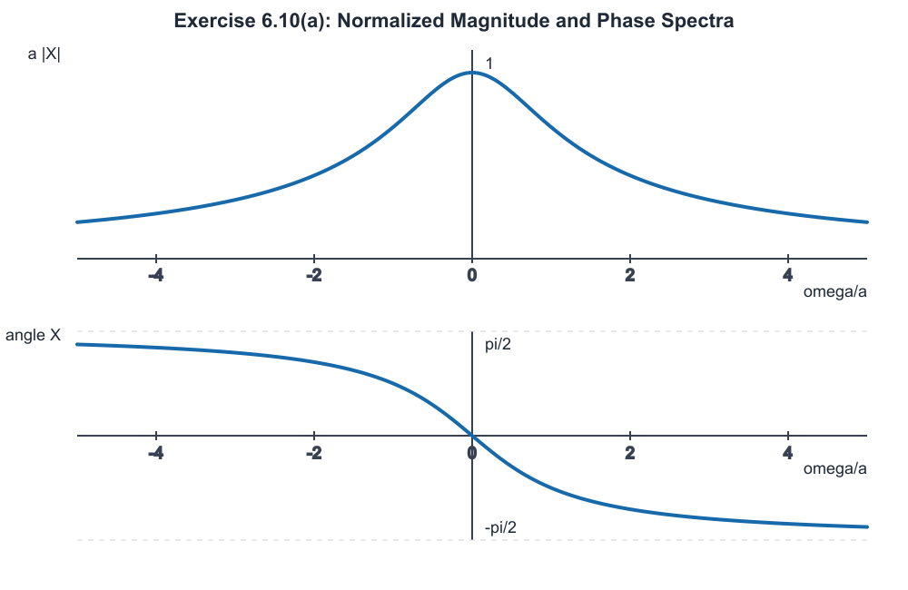

# ECE 260 Tutorial 5 Materials

Continuous-Time Fourier Transform

This tutorial handout focuses on computing continuous-time Fourier transforms
from the analysis equation and from transform properties, handling periodic
signals, and interpreting magnitude and phase spectra.

It is intended as tutorial support. The textbook, lecture slides, course
website, and official announcements remain the authoritative course materials.

---

## Quick Recap

### 1. CTFT Analysis and Synthesis Equations

The continuous-time Fourier transform of $x(t)$ is

```math
X(\omega)
=
\int_{-\infty}^{\infty}
x(t)e^{-j\omega t}\,dt.
```

This is the analysis equation. It converts a time-domain signal into its
frequency-domain spectrum.

The inverse Fourier transform is

```math
x(t)
=
\frac{1}{2\pi}
\int_{-\infty}^{\infty}
X(\omega)e^{j\omega t}\,d\omega.
```

The transform pair is written as

```math
x(t)\ \mathrm{CTFT}\longleftrightarrow\ X(\omega).
```

Under this convention, the factor $1/(2\pi)$ appears only in the inverse
transform.

### 2. Transform Pairs Used Today

For $a>0$,

```math
e^{-at}u(t)
\ \mathrm{CTFT}\longleftrightarrow\
\frac{1}{a+j\omega}.
```

The unit step has the generalized Fourier transform

```math
u(t)
\ \mathrm{CTFT}\longleftrightarrow\
\pi\delta(\omega)+\frac{1}{j\omega}.
```

The term $1/(j\omega)$ is interpreted in the principal-value sense.

The shifted impulse pair is

```math
\delta(t-t_{0})
\ \mathrm{CTFT}\longleftrightarrow\
e^{-j\omega t_{0}}.
```

### 3. Time Shifting, Scaling, and Modulation

Time shifting:

```math
x(t-t_{0})
\ \mathrm{CTFT}\longleftrightarrow\
e^{-j\omega t_{0}}X(\omega).
```

Time scaling:

```math
x(at)
\ \mathrm{CTFT}\longleftrightarrow\
\frac{1}{|a|}
X\left(\frac{\omega}{a}\right),
\qquad
a\ne0.
```

Frequency shifting, also called modulation:

```math
e^{j\omega_{0}t}x(t)
\ \mathrm{CTFT}\longleftrightarrow\
X(\omega-\omega_{0}).
```

These properties do different things:

- shifting in time multiplies the spectrum by a phase factor;
- scaling in time scales and stretches or compresses the spectrum;
- multiplying by a complex sinusoid shifts the spectrum horizontally.

### 4. Fourier Transform of a Periodic Signal

Suppose a periodic signal has period $T$, fundamental frequency

```math
\omega_{0}=\frac{2\pi}{T},
```

and CTFS coefficients

```math
a_{k}
=
\frac{1}{T}
\int_{T}
x(t)e^{-jk\omega_{0}t}\,dt.
```

Then its generalized Fourier transform is

```math
X(\omega)
=
\sum_{k=-\infty}^{\infty}
2\pi a_{k}\delta(\omega-k\omega_{0}).
```

A periodic signal therefore has an impulse spectrum located at the harmonic
frequencies $k\omega_{0}$.

### 5. Magnitude and Phase Spectra

If

```math
X(\omega)
=
|X(\omega)|e^{j\angle X(\omega)},
```

then:

- $X(\omega)$ is the frequency spectrum;
- $|X(\omega)|$ is the magnitude spectrum;
- $\angle X(\omega)$ is the phase spectrum.

If $x(t)$ is real, then

```math
X(\omega)=X^{*}(-\omega).
```

Therefore:

```math
|X(\omega)|=|X(-\omega)|
```

and

```math
\angle X(\omega)=-\angle X(-\omega).
```

For a real signal, the magnitude spectrum is even and the phase spectrum is
odd.

---

## Selected Questions

## Q1. Exercise 6.1(b): Fourier Transform by First Principles

### Problem

Using the Fourier-transform analysis equation, find the Fourier transform of

```math
x(t)=e^{-4t}u(t-1).
```

### Route

This problem explicitly asks for first principles, so we should use the
analysis equation rather than immediately applying a transform table.

The unit step $u(t-1)$ determines the interval on which the signal is nonzero.
We will:

1. convert the unit step into a condition on $t$;
2. determine the correct integration limits;
3. combine the exponential factors;
4. evaluate the improper integral;
5. simplify the result;
6. check the answer at $\omega=0$.

### Knowledge Needed

The unit step satisfies

```math
u(t-1)=
\begin{cases}
0, & t<1,\\
1, & t>1.
\end{cases}
```

The value assigned exactly at $t=1$ does not affect the Fourier-transform
integral.

The CTFT analysis equation is

```math
X(\omega)
=
\int_{-\infty}^{\infty}
x(t)e^{-j\omega t}\,dt.
```

### Solution

#### Step 1: Determine Where the Signal Is Nonzero

Because of $u(t-1)$,

```math
x(t)=
\begin{cases}
0, & t<1,\\
e^{-4t}, & t\ge1.
\end{cases}
```

Therefore, the integral over $(-\infty,1)$ is zero.

#### Step 2: Substitute Into the Analysis Equation

```math
\begin{aligned}
X(\omega)
&=
\int_{-\infty}^{\infty}
e^{-4t}u(t-1)e^{-j\omega t}\,dt\\
&=
\int_{1}^{\infty}
e^{-4t}e^{-j\omega t}\,dt.
\end{aligned}
```

#### Step 3: Combine the Exponentials

Use

```math
e^{A}e^{B}=e^{A+B}.
```

Then

```math
e^{-4t}e^{-j\omega t}
=
e^{-(4+j\omega)t}.
```

Thus,

```math
X(\omega)
=
\int_{1}^{\infty}
e^{-(4+j\omega)t}\,dt.
```

#### Step 4: Evaluate the Improper Integral

An antiderivative is

```math
\int
e^{-(4+j\omega)t}\,dt
=
-\frac{1}{4+j\omega}
e^{-(4+j\omega)t}.
```

Therefore,

```math
\begin{aligned}
X(\omega)
&=
\lim_{b\to\infty}
\left[
-\frac{1}{4+j\omega}
e^{-(4+j\omega)t}
\right]_{1}^{b}\\
&=
\lim_{b\to\infty}
\left[
-\frac{e^{-(4+j\omega)b}}{4+j\omega}
+
\frac{e^{-(4+j\omega)}}{4+j\omega}
\right].
\end{aligned}
```

Now examine the first exponential:

```math
e^{-(4+j\omega)b}
=
e^{-4b}e^{-j\omega b}.
```

Its magnitude is

```math
\left|
e^{-4b}e^{-j\omega b}
\right|
=
e^{-4b}.
```

Since $e^{-4b}\to0$ as $b\to\infty$,

```math
\lim_{b\to\infty}
e^{-(4+j\omega)b}
=
0.
```

Hence,

```math
X(\omega)
=
\frac{e^{-(4+j\omega)}}{4+j\omega}.
```

#### Step 5: Separate the Real Decay and Phase Factor

```math
e^{-(4+j\omega)}
=
e^{-4}e^{-j\omega}.
```

Therefore,

```math
X(\omega)
=
\frac{e^{-4}e^{-j\omega}}{4+j\omega}.
```

#### Step 6: Check the Result at $\omega=0$

From the definition,

```math
\begin{aligned}
X(0)
&=
\int_{-\infty}^{\infty}
x(t)\,dt\\
&=
\int_{1}^{\infty}
e^{-4t}\,dt\\
&=
\left[
-\frac{1}{4}e^{-4t}
\right]_{1}^{\infty}\\
&=
\frac{e^{-4}}{4}.
\end{aligned}
```

Using the derived transform,

```math
X(0)
=
\frac{e^{-4}e^{0}}{4}
=
\frac{e^{-4}}{4}.
```

The two calculations agree.

### Interpretation

The factor

```math
e^{-j\omega}
```

is produced by the starting time $t=1$. It is a frequency-dependent phase
factor. The factor $e^{-4}$ is the value of the decaying exponential at the
starting time.

### Final Result

```math
\boxed{
X(\omega)
=
\frac{e^{-(4+j\omega)}}{4+j\omega}
=
\frac{e^{-4}e^{-j\omega}}{4+j\omega}
}
```

---

## Q2. Exercise 6.3(b): Transform Using a Table and Properties

### Problem

Use a Fourier-transform table and properties to find the transform of

```math
x(t)=e^{-j5t}u(t+2).
```

### Route

This signal contains two operations:

1. $u(t)$ is shifted left by $2$ to produce $u(t+2)$;
2. the shifted step is multiplied by $e^{-j5t}$.

The corresponding frequency-domain operations are:

1. a time shift, which introduces a phase factor;
2. modulation, which shifts the complete spectrum.

We will carefully apply the operations in the same order.

### Knowledge Needed

The unit-step transform pair is

```math
u(t)
\ \mathrm{CTFT}\longleftrightarrow\
U(\omega)
=
\pi\delta(\omega)
+
\frac{1}{j\omega}.
```

Time shifting:

```math
v(t-t_{0})
\ \mathrm{CTFT}\longleftrightarrow\
e^{-j\omega t_{0}}V(\omega).
```

Frequency shifting:

```math
e^{j\omega_{0}t}v(t)
\ \mathrm{CTFT}\longleftrightarrow\
V(\omega-\omega_{0}).
```

Impulse multiplication:

```math
f(\omega)\delta(\omega-\omega_{0})
=
f(\omega_{0})\delta(\omega-\omega_{0}).
```

### Solution

#### Step 1: Express the Left Shift in Standard Form

The standard time-shift form is $u(t-t_{0})$. Write

```math
u(t+2)
=
u[t-(-2)].
```

Therefore,

```math
t_{0}=-2.
```

#### Step 2: Find the Transform of $u(t+2)$

Define

```math
v(t)=u(t+2).
```

Using the time-shifting property,

```math
\begin{aligned}
V(\omega)
&=
e^{-j\omega(-2)}U(\omega)\\
&=
e^{j2\omega}U(\omega).
\end{aligned}
```

Substitute the transform of $u(t)$:

```math
V(\omega)
=
e^{j2\omega}
\left[
\pi\delta(\omega)
+
\frac{1}{j\omega}
\right].
```

Distribute the phase factor:

```math
V(\omega)
=
\pi e^{j2\omega}\delta(\omega)
+
\frac{e^{j2\omega}}{j\omega}.
```

For the impulse term,

```math
e^{j2\omega}\delta(\omega)
=
e^{j2(0)}\delta(\omega)
=
\delta(\omega).
```

Thus,

```math
V(\omega)
=
\pi\delta(\omega)
+
\frac{e^{j2\omega}}{j\omega}.
```

Both forms for $V(\omega)$ are equivalent:

```math
V(\omega)
=
e^{j2\omega}
\left[
\pi\delta(\omega)
+
\frac{1}{j\omega}
\right]
```

or

```math
V(\omega)
=
\pi\delta(\omega)
+
\frac{e^{j2\omega}}{j\omega}.
```

#### Step 3: Identify the Modulation Frequency

The original signal is

```math
x(t)
=
e^{-j5t}v(t).
```

Compare $e^{-j5t}$ with the standard form $e^{j\omega_{0}t}$:

```math
\omega_{0}=-5.
```

Therefore, the modulation property gives

```math
\begin{aligned}
X(\omega)
&=
V(\omega-\omega_{0})\\
&=
V[\omega-(-5)]\\
&=
V(\omega+5).
\end{aligned}
```

This means the entire function $V(\omega)$ must be evaluated at $\omega+5$.

#### Step 4: Substitute $\omega+5$ Into the Complete Spectrum

Using

```math
V(\omega)
=
\pi\delta(\omega)
+
\frac{e^{j2\omega}}{j\omega},
```

we obtain

```math
\begin{aligned}
X(\omega)
&=
V(\omega+5)\\
&=
\pi\delta(\omega+5)
+
\frac{
e^{j2(\omega+5)}
}{
j(\omega+5)
}.
\end{aligned}
```

Equivalently, before simplifying the impulse factor,

```math
X(\omega)
=
e^{j2(\omega+5)}
\left[
\pi\delta(\omega+5)
+
\frac{1}{j(\omega+5)}
\right].
```

For the impulse term,

```math
e^{j2(\omega+5)}\delta(\omega+5)
```

samples the exponential at $\omega=-5$. At that point,

```math
e^{j2(-5+5)}
=
e^{0}
=
1.
```

Therefore,

```math
e^{j2(\omega+5)}\delta(\omega+5)
=
\delta(\omega+5),
```

which confirms the simplified expression.

### Interpretation

The spectrum of $u(t+2)$ originally has its singularity at $\omega=0$.
Multiplication by $e^{-j5t}$ shifts that spectrum left by $5$, so the
singularity moves to

```math
\omega=-5.
```

The time shift by $-2$ also introduces the phase factor

```math
e^{j2(\omega+5)}.
```

### Common Sign Check

The modulation rule is

```math
e^{j\omega_{0}t}v(t)
\ \mathrm{CTFT}\longleftrightarrow\
V(\omega-\omega_{0}).
```

Here $\omega_{0}=-5$, so

```math
\omega-\omega_{0}
=
\omega+5.
```

The answer must involve $\omega+5$, not $\omega-5$.

### Final Result

```math
\boxed{
X(\omega)
=
\pi\delta(\omega+5)
+
\frac{
e^{j2(\omega+5)}
}{
j(\omega+5)
}
}
```

The non-impulse term is interpreted in the principal-value sense.

---

## Q3. Exercise 6.4(a): General Time Scaling and Shifting

### Problem

Let

```math
x(t)\ \mathrm{CTFT}\longleftrightarrow\ X(\omega).
```

Find $Y(\omega)$ in terms of $X(\omega)$ if

```math
y(t)=x(at-b),
\qquad
a\ne0.
```

### Route

The argument $at-b$ contains both scaling and shifting. A reliable approach is
to rewrite it as

```math
at-b
=
a\left(t-\frac{b}{a}\right).
```

Then:

1. define a scaled signal $v(t)=x(at)$;
2. recognize $y(t)$ as a shifted version of $v(t)$;
3. apply time scaling;
4. apply time shifting;
5. verify the result directly from the analysis equation.

The direct verification is useful because it automatically handles both
positive and negative values of $a$.

### Knowledge Needed

Time scaling:

```math
x(at)
\ \mathrm{CTFT}\longleftrightarrow\
\frac{1}{|a|}
X\left(\frac{\omega}{a}\right).
```

Time shifting:

```math
v(t-t_{0})
\ \mathrm{CTFT}\longleftrightarrow\
e^{-j\omega t_{0}}V(\omega).
```

### Solution: Property Method

#### Step 1: Factor the Time-Domain Argument

```math
at-b
=
a\left(t-\frac{b}{a}\right).
```

Therefore,

```math
y(t)
=
x\left[
a\left(t-\frac{b}{a}\right)
\right].
```

#### Step 2: Define the Scaled Signal

Let

```math
v(t)=x(at).
```

The time-scaling property gives

```math
V(\omega)
=
\frac{1}{|a|}
X\left(\frac{\omega}{a}\right).
```

The absolute value is required because the change of variable reverses the
integration limits when $a<0$.

#### Step 3: Express $y(t)$ as a Shift of $v(t)$

Since

```math
v\left(t-\frac{b}{a}\right)
=
x\left[
a\left(t-\frac{b}{a}\right)
\right],
```

we have

```math
y(t)
=
v\left(t-\frac{b}{a}\right).
```

Thus, the shift amount is

```math
t_{0}=\frac{b}{a}.
```

#### Step 4: Apply the Time-Shifting Property

```math
\begin{aligned}
Y(\omega)
&=
e^{-j\omega b/a}V(\omega)\\
&=
e^{-j\omega b/a}
\left[
\frac{1}{|a|}
X\left(\frac{\omega}{a}\right)
\right].
\end{aligned}
```

Therefore,

```math
Y(\omega)
=
\frac{1}{|a|}
e^{-j\omega b/a}
X\left(\frac{\omega}{a}\right).
```

### Direct Verification From the Analysis Equation

Start with

```math
\begin{aligned}
Y(\omega)
&=
\int_{-\infty}^{\infty}
y(t)e^{-j\omega t}\,dt\\
&=
\int_{-\infty}^{\infty}
x(at-b)e^{-j\omega t}\,dt.
\end{aligned}
```

Let

```math
\lambda=at-b.
```

Then

```math
t=\frac{\lambda+b}{a}
```

and

```math
dt=\frac{d\lambda}{a}.
```

The sign of $a$ affects the transformed integration limits.

#### Case 1: $a>0$

As $t$ increases from $-\infty$ to $\infty$, $\lambda$ also increases from
$-\infty$ to $\infty$. Therefore,

```math
\begin{aligned}
Y(\omega)
&=
\int_{-\infty}^{\infty}
x(\lambda)
e^{-j\omega(\lambda+b)/a}
\frac{d\lambda}{a}\\
&=
\frac{1}{a}
e^{-j\omega b/a}
\int_{-\infty}^{\infty}
x(\lambda)
e^{-j(\omega/a)\lambda}
\,d\lambda\\
&=
\frac{1}{a}
e^{-j\omega b/a}
X\left(\frac{\omega}{a}\right).
\end{aligned}
```

Since $a>0$, $a=|a|$, so

```math
Y(\omega)
=
\frac{1}{|a|}
e^{-j\omega b/a}
X\left(\frac{\omega}{a}\right).
```

#### Case 2: $a<0$

As $t$ increases from $-\infty$ to $\infty$, $\lambda=at-b$ decreases from
$\infty$ to $-\infty$. Therefore,

```math
\begin{aligned}
Y(\omega)
&=
\int_{\infty}^{-\infty}
x(\lambda)
e^{-j\omega(\lambda+b)/a}
\frac{d\lambda}{a}\\
&=
-\frac{1}{a}
e^{-j\omega b/a}
\int_{-\infty}^{\infty}
x(\lambda)
e^{-j(\omega/a)\lambda}
\,d\lambda.
\end{aligned}
```

Because $a<0$,

```math
-a=|a|
```

and therefore

```math
-\frac{1}{a}
=
\frac{1}{|a|}.
```

Hence,

```math
Y(\omega)
=
\frac{1}{|a|}
e^{-j\omega b/a}
X\left(\frac{\omega}{a}\right).
```

Both cases produce the same general formula.

### Common Mistakes

1. Omitting the absolute value and writing $1/a$ instead of $1/|a|$.
2. Treating $b$ as the time shift. The actual shift is $b/a$.
3. Writing $X(a\omega)$ instead of $X(\omega/a)$.
4. Using the phase factor $e^{-j\omega b}$ instead of
   $e^{-j\omega b/a}$.

### Final Result

```math
\boxed{
Y(\omega)
=
\frac{1}{|a|}
e^{-j\omega b/a}
X\left(\frac{\omega}{a}\right)
}
```

---

## Q4. Exercise 6.5(a): Fourier Transform of a Periodic Impulse Signal

### Problem

Find the Fourier transform of the periodic signal shown in Exercise 6.5(a).

The impulses shown in the graph are:

- positive unit impulses at $t=\ldots,-3,1,5,\ldots$;
- negative unit impulses at $t=\ldots,-1,3,7,\ldots$.

### Route

This is a periodic signal, so we should not try to compute its transform using
an ordinary convergent integral over the entire time axis.

Instead:

1. identify the fundamental period $T$;
2. find the fundamental frequency $\omega_{0}$;
3. choose one convenient period;
4. compute the CTFS coefficients $a_{k}$;
5. convert the CTFS coefficients into the generalized CTFT impulse spectrum;
6. inspect which harmonic impulses have zero or nonzero weights.

### Knowledge Needed

For a periodic signal with period $T$,

```math
\omega_{0}=\frac{2\pi}{T}.
```

Its CTFS coefficients are

```math
a_{k}
=
\frac{1}{T}
\int_{T}
x(t)e^{-jk\omega_{0}t}\,dt.
```

The impulse-sifting property is

```math
\int_{-\infty}^{\infty}
\delta(t-t_{0})f(t)\,dt
=
f(t_{0}).
```

The generalized CTFT of a periodic signal is

```math
X(\omega)
=
\sum_{k=-\infty}^{\infty}
2\pi a_{k}\delta(\omega-k\omega_{0}).
```

### Solution

#### Step 1: Identify the Fundamental Period

The positive impulses occur at

```math
t=1+4n,
\qquad
n\in\mathbb{Z},
```

and the negative impulses occur at

```math
t=3+4n,
\qquad
n\in\mathbb{Z}.
```

Shifting the entire signal by $4$ reproduces the same positive and negative
impulses. Therefore,

```math
T=4.
```

A shift by $2$ exchanges positive and negative impulses, so $2$ is not a
period. Thus, $4$ is the fundamental period.

#### Step 2: Find the Fundamental Frequency

```math
\begin{aligned}
\omega_{0}
&=
\frac{2\pi}{T}\\
&=
\frac{2\pi}{4}\\
&=
\frac{\pi}{2}.
\end{aligned}
```

#### Step 3: Choose One Period

Choose

```math
0\le t<4.
```

On this interval, the signal contains:

- a positive unit impulse at $t=1$;
- a negative unit impulse at $t=3$.

Therefore, over this period,

```math
x(t)
=
\delta(t-1)-\delta(t-3).
```

#### Step 4: Write the CTFS Analysis Equation

```math
\begin{aligned}
a_{k}
&=
\frac{1}{4}
\int_{0}^{4}
x(t)e^{-jk\omega_{0}t}\,dt\\
&=
\frac{1}{4}
\int_{0}^{4}
\left[
\delta(t-1)-\delta(t-3)
\right]
e^{-jk\omega_{0}t}\,dt.
\end{aligned}
```

Distribute the integral:

```math
\begin{aligned}
a_{k}
&=
\frac{1}{4}
\int_{0}^{4}
\delta(t-1)e^{-jk\omega_{0}t}\,dt\\
&\quad-
\frac{1}{4}
\int_{0}^{4}
\delta(t-3)e^{-jk\omega_{0}t}\,dt.
\end{aligned}
```

#### Step 5: Apply the Impulse-Sifting Property

The first impulse samples the exponential at $t=1$:

```math
\int_{0}^{4}
\delta(t-1)e^{-jk\omega_{0}t}\,dt
=
e^{-jk\omega_{0}}.
```

The second impulse samples it at $t=3$:

```math
\int_{0}^{4}
\delta(t-3)e^{-jk\omega_{0}t}\,dt
=
e^{-j3k\omega_{0}}.
```

Thus,

```math
a_{k}
=
\frac{1}{4}
\left[
e^{-jk\omega_{0}}
-
e^{-j3k\omega_{0}}
\right].
```

Substitute $\omega_{0}=\pi/2$:

```math
a_{k}
=
\frac{1}{4}
\left[
e^{-jk\pi/2}
-
e^{-j3k\pi/2}
\right].
```

This expression is already a complete and correct answer for the CTFS
coefficient sequence. We now simplify it to reveal its harmonic pattern.

#### Step 6: Simplify the CTFS Coefficients

Write the two exponentials relative to their midpoint exponent
$e^{-jk\pi}$:

```math
e^{-jk\pi/2}
=
e^{-jk\pi}e^{jk\pi/2},
```

```math
e^{-j3k\pi/2}
=
e^{-jk\pi}e^{-jk\pi/2}.
```

Therefore,

```math
\begin{aligned}
a_{k}
&=
\frac{1}{4}
e^{-jk\pi}
\left[
e^{jk\pi/2}
-
e^{-jk\pi/2}
\right].
\end{aligned}
```

Using

```math
e^{j\theta}-e^{-j\theta}
=
2j\sin\theta,
```

we obtain

```math
\begin{aligned}
a_{k}
&=
\frac{1}{4}
e^{-jk\pi}
\left[
2j\sin\left(\frac{k\pi}{2}\right)
\right]\\
&=
\frac{j}{2}
e^{-jk\pi}
\sin\left(\frac{k\pi}{2}\right).
\end{aligned}
```

For integer $k$,

```math
e^{-jk\pi}=(-1)^{k}.
```

Also, whenever $\sin(k\pi/2)$ is nonzero, $k$ is odd and
$(-1)^{k}=-1$. When $k$ is even, the sine factor is zero. Therefore, the
coefficient sequence can be written compactly as

```math
a_{k}
=
-\frac{j}{2}
\sin\left(\frac{k\pi}{2}\right).
```

#### Step 7: Inspect Several Coefficients

For $k=0$,

```math
a_{0}
=
-\frac{j}{2}\sin(0)
=
0.
```

This makes sense because the positive and negative impulses over one period
have zero net area.

For $k=1$,

```math
a_{1}
=
-\frac{j}{2}\sin\left(\frac{\pi}{2}\right)
=
-\frac{j}{2}.
```

For $k=-1$,

```math
a_{-1}
=
-\frac{j}{2}\sin\left(-\frac{\pi}{2}\right)
=
\frac{j}{2}.
```

For $k=2$,

```math
a_{2}
=
-\frac{j}{2}\sin(\pi)
=
0.
```

For $k=3$,

```math
a_{3}
=
-\frac{j}{2}\sin\left(\frac{3\pi}{2}\right)
=
\frac{j}{2}.
```

Thus:

- all even-index coefficients are zero;
- all odd-index coefficients have magnitude $1/2$;
- their signs alternate.

The signal is real, so its coefficients should satisfy

```math
a_{-k}=a_{k}^{*}.
```

For example,

```math
a_{-1}=\frac{j}{2}=a_{1}^{*},
```

so the symmetry check passes.

#### Step 8: Convert the CTFS Coefficients to the CTFT

For a periodic signal,

```math
X(\omega)
=
\sum_{k=-\infty}^{\infty}
2\pi a_{k}
\delta(\omega-k\omega_{0}).
```

Substitute

```math
a_{k}
=
-\frac{j}{2}
\sin\left(\frac{k\pi}{2}\right)
```

and

```math
\omega_{0}=\frac{\pi}{2}.
```

Then

```math
\begin{aligned}
X(\omega)
&=
\sum_{k=-\infty}^{\infty}
2\pi
\left[
-\frac{j}{2}
\sin\left(\frac{k\pi}{2}\right)
\right]
\delta\left(
\omega-\frac{k\pi}{2}
\right)\\
&=
-j\pi
\sum_{k=-\infty}^{\infty}
\sin\left(\frac{k\pi}{2}\right)
\delta\left(
\omega-\frac{k\pi}{2}
\right).
\end{aligned}
```

#### Step 9: Identify the Locations and Weights

The impulses are located at

```math
\omega=k\frac{\pi}{2}.
```

For even $k$, the weight is zero.

For odd $k$, the first several nonzero spectral impulses are:

| $k$ | $\omega=k\pi/2$ | $2\pi a_{k}$ |
|---:|---:|---:|
| $-3$ | $-3\pi/2$ | $-j\pi$ |
| $-1$ | $-\pi/2$ | $j\pi$ |
| $1$ | $\pi/2$ | $-j\pi$ |
| $3$ | $3\pi/2$ | $j\pi$ |

The weights continue alternating as $k$ moves through the odd integers.

### Final Result

```math
\boxed{
X(\omega)
=
-j\pi
\sum_{k=-\infty}^{\infty}
\sin\left(\frac{k\pi}{2}\right)
\delta\left(
\omega-\frac{k\pi}{2}
\right)
}
```

An equivalent unsimplified form is

```math
\boxed{
X(\omega)
=
\frac{\pi}{2}
\sum_{k=-\infty}^{\infty}
\left[
e^{-jk\pi/2}
-
e^{-j3k\pi/2}
\right]
\delta\left(
\omega-\frac{k\pi}{2}
\right).
}
```

---

## Q5. Exercise 6.10(a): Frequency, Magnitude, and Phase Spectra

### Problem

For

```math
x(t)=e^{-at}u(t),
\qquad
a>0,
```

compute the frequency spectrum and find and plot the corresponding magnitude
and phase spectra.

### Route

We will:

1. compute $X(\omega)$ directly from the analysis equation;
2. rewrite the result in rectangular form;
3. calculate the magnitude;
4. calculate the phase;
5. identify the symmetry and limiting values;
6. use these features to sketch the spectra.

### Knowledge Needed

For a complex number

```math
z=p+jq,
```

its magnitude is

```math
|z|=\sqrt{p^{2}+q^{2}}.
```

For $a>0$,

```math
\angle(a+j\omega)
=
\tan^{-1}\left(\frac{\omega}{a}\right).
```

Also,

```math
\left|
\frac{1}{z}
\right|
=
\frac{1}{|z|}
```

and

```math
\angle\left(\frac{1}{z}\right)
=
-\angle z.
```

### Solution

#### Step 1: Determine the Nonzero Time Interval

Because of $u(t)$,

```math
x(t)=
\begin{cases}
0, & t<0,\\
e^{-at}, & t\ge0.
\end{cases}
```

Therefore, the CTFT integral begins at $t=0$.

#### Step 2: Apply the Analysis Equation

```math
\begin{aligned}
X(\omega)
&=
\int_{-\infty}^{\infty}
e^{-at}u(t)e^{-j\omega t}\,dt\\
&=
\int_{0}^{\infty}
e^{-at}e^{-j\omega t}\,dt.
\end{aligned}
```

Combine the exponentials:

```math
e^{-at}e^{-j\omega t}
=
e^{-(a+j\omega)t}.
```

Thus,

```math
X(\omega)
=
\int_{0}^{\infty}
e^{-(a+j\omega)t}\,dt.
```

#### Step 3: Evaluate the Improper Integral

```math
\begin{aligned}
X(\omega)
&=
\lim_{b\to\infty}
\int_{0}^{b}
e^{-(a+j\omega)t}\,dt\\
&=
\lim_{b\to\infty}
\left[
-\frac{1}{a+j\omega}
e^{-(a+j\omega)t}
\right]_{0}^{b}\\
&=
\lim_{b\to\infty}
\left[
-\frac{e^{-(a+j\omega)b}}{a+j\omega}
+
\frac{1}{a+j\omega}
\right].
\end{aligned}
```

Since

```math
e^{-(a+j\omega)b}
=
e^{-ab}e^{-j\omega b}
```

and $a>0$,

```math
\lim_{b\to\infty}e^{-ab}=0.
```

Therefore,

```math
X(\omega)
=
\frac{1}{a+j\omega}.
```

The requirement $a>0$ is important because it makes the time-domain
exponential decay and ensures convergence.

#### Step 4: Rewrite the Frequency Spectrum in Rectangular Form

Multiply the numerator and denominator by the complex conjugate
$a-j\omega$:

```math
\begin{aligned}
X(\omega)
&=
\frac{1}{a+j\omega}
\cdot
\frac{a-j\omega}{a-j\omega}\\
&=
\frac{a-j\omega}
{(a+j\omega)(a-j\omega)}.
\end{aligned}
```

The denominator is

```math
\begin{aligned}
(a+j\omega)(a-j\omega)
&=
a^{2}-(j\omega)^{2}\\
&=
a^{2}+\omega^{2}.
\end{aligned}
```

Thus,

```math
\begin{aligned}
X(\omega)
&=
\frac{a-j\omega}{a^{2}+\omega^{2}}\\
&=
\frac{a}{a^{2}+\omega^{2}}
-
j\frac{\omega}{a^{2}+\omega^{2}}.
\end{aligned}
```

Therefore,

```math
\mathrm{Re}\{X(\omega)\}
=
\frac{a}{a^{2}+\omega^{2}},
```

```math
\mathrm{Im}\{X(\omega)\}
=
-\frac{\omega}{a^{2}+\omega^{2}}.
```

#### Step 5: Compute the Magnitude Spectrum

Starting from

```math
X(\omega)=\frac{1}{a+j\omega},
```

we have

```math
\begin{aligned}
|X(\omega)|
&=
\left|
\frac{1}{a+j\omega}
\right|\\
&=
\frac{1}{|a+j\omega|}.
\end{aligned}
```

Now,

```math
|a+j\omega|
=
\sqrt{a^{2}+\omega^{2}}.
```

Therefore,

```math
|X(\omega)|
=
\frac{1}{\sqrt{a^{2}+\omega^{2}}}.
```

The same result follows from the rectangular form:

```math
\begin{aligned}
|X(\omega)|
&=
\sqrt{
\left[
\frac{a}{a^{2}+\omega^{2}}
\right]^{2}
+
\left[
-\frac{\omega}{a^{2}+\omega^{2}}
\right]^{2}
}\\
&=
\sqrt{
\frac{a^{2}+\omega^{2}}
{(a^{2}+\omega^{2})^{2}}
}\\
&=
\frac{1}{\sqrt{a^{2}+\omega^{2}}}.
\end{aligned}
```

#### Step 6: Compute the Phase Spectrum

Because

```math
X(\omega)=\frac{1}{a+j\omega},
```

the phase is

```math
\begin{aligned}
\angle X(\omega)
&=
\angle 1-\angle(a+j\omega)\\
&=
0-\angle(a+j\omega).
\end{aligned}
```

Since $a>0$, the point $a+j\omega$ always lies in the right half of the
complex plane. Its phase is

```math
\angle(a+j\omega)
=
\tan^{-1}\left(\frac{\omega}{a}\right).
```

Therefore,

```math
\angle X(\omega)
=
-\tan^{-1}\left(\frac{\omega}{a}\right).
```

No additional quadrant correction is required because the real part $a$ is
strictly positive.

#### Step 7: Identify the Magnitude-Spectrum Features

At $\omega=0$,

```math
|X(0)|
=
\frac{1}{\sqrt{a^{2}}}
=
\frac{1}{a},
```

because $a>0$.

As $|\omega|\to\infty$,

```math
|X(\omega)|
=
\frac{1}{\sqrt{a^{2}+\omega^{2}}}
\to0.
```

Also,

```math
|X(-\omega)|
=
\frac{1}{\sqrt{a^{2}+(-\omega)^{2}}}
=
|X(\omega)|.
```

Thus, the magnitude spectrum:

- is even;
- has its maximum value $1/a$ at $\omega=0$;
- decreases as $|\omega|$ increases;
- approaches zero for large $|\omega|$.

#### Step 8: Identify the Phase-Spectrum Features

At $\omega=0$,

```math
\angle X(0)
=
-\tan^{-1}(0)
=
0.
```

As $\omega\to\infty$,

```math
\angle X(\omega)
\to
-\frac{\pi}{2}.
```

As $\omega\to-\infty$,

```math
\angle X(\omega)
\to
\frac{\pi}{2}.
```

Also,

```math
\begin{aligned}
\angle X(-\omega)
&=
-\tan^{-1}\left(\frac{-\omega}{a}\right)\\
&=
\tan^{-1}\left(\frac{\omega}{a}\right)\\
&=
-\angle X(\omega).
\end{aligned}
```

Thus, the phase spectrum is odd.

These symmetry results are expected because $x(t)$ is real.

#### Step 9: Normalized Spectrum Plots

The following plots use

```math
\frac{\omega}{a}
```

on the horizontal axis and

```math
a|X(\omega)|
```

on the magnitude axis. Therefore, the same normalized curves apply for every
$a>0$.



### Final Result

Frequency spectrum:

```math
\boxed{
X(\omega)
=
\frac{1}{a+j\omega}
=
\frac{a}{a^{2}+\omega^{2}}
-
j\frac{\omega}{a^{2}+\omega^{2}}
}
```

Magnitude spectrum:

```math
\boxed{
|X(\omega)|
=
\frac{1}{\sqrt{a^{2}+\omega^{2}}}
}
```

Phase spectrum:

```math
\boxed{
\angle X(\omega)
=
-\tan^{-1}\left(\frac{\omega}{a}\right)
}
```

---

## Final Problem-Solving Checklist

For direct CTFT integration:

1. Determine where the signal is nonzero.
2. Set the integration limits from the signal support.
3. Combine exponential factors before integrating.
4. Evaluate improper limits explicitly.
5. Check $X(0)$ against the area under $x(t)$.

For transform properties:

1. Begin with a known transform pair.
2. Name an intermediate signal if several operations are present.
3. Apply one property at a time.
4. Substitute into the complete spectrum, including phase factors.
5. Track the sign in every frequency shift.

For a periodic signal:

1. Find the fundamental period $T$.
2. Calculate $\omega_{0}=2\pi/T$.
3. Compute the CTFS coefficients $a_{k}$ over one period.
4. Use

```math
X(\omega)
=
\sum_{k=-\infty}^{\infty}
2\pi a_{k}\delta(\omega-k\omega_{0}).
```

For magnitude and phase:

1. Write $X(\omega)$ in a convenient complex form.
2. Compute $|X(\omega)|$.
3. Determine the correct phase quadrant.
4. Check symmetry when $x(t)$ is real.
5. Identify values at $\omega=0$ and limits as $|\omega|\to\infty$.
